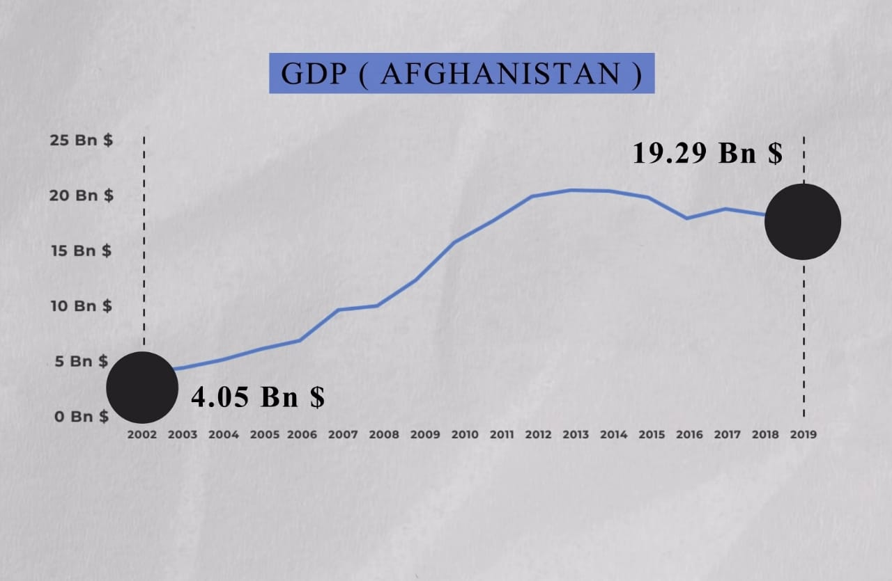
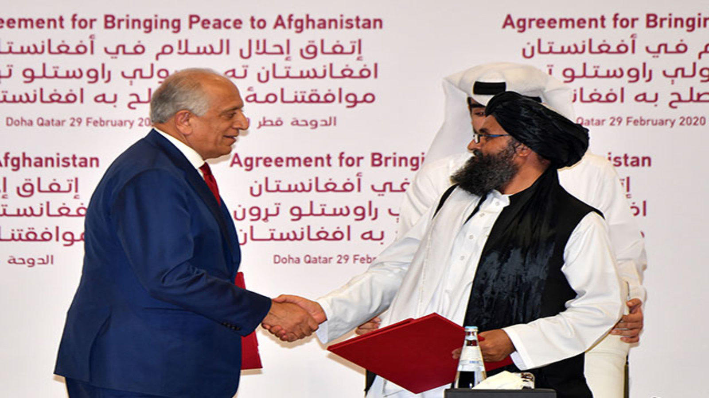

## History

In 2001, Al Qaeda, a terrorist group hijacked four US airplanes. Hijackers intentionally flew the two planes into the World Trade Centre building, the third plane into the pentagon and the fourth plane crashed into the field of Pennsylvania. Thousands of people lost their lives in that attack. This attack is also known as the *‘‘September 11 attacks or 9/11 attacks’’*.It was the deadliest attack ever on the US.

After the investigation, it was found out that Al Qaeda and its leader Osama Bin Laden were behind the attack. The, then US President George Bush demanded the Taliban to extradite Osama Bin Laden and cut off Al Qaeda but the Taliban rejected and asked him to show the proof that they are involved.

## Operation Enduring Freedom

The US and its NATO allies collectively invaded Afghanistan on 7 October 2001 to destroy the al Qaeda terrorist network and the government of the Taliban from Afghanistan. This operation is commonly known as *“Enduring Freedom”*.

During these 20 years, Pakistan acted as a safe haven for the Taliban to plan, retrain and replenish the terrorists. Pakistan has been greylisted by the Financial Action Task Force to prevent safe havens for Talibani terrorists.

## Twenty years of war

Many troops of the US and its allies have died over the years.10 Billion Dollars have been spent to prevent Opium Production but failed to do so as most of the people in Afghanistan earn through Opium and it is also the source of revenue for the Taliban.US spent $87 Billion to train Afghan soldiers .$24 Billion and  $30 Billion have been spent on Economic Development and Reconstruction Program, respectively.

The GDP of Afghan has grown from $4.05 Billion in 2004 to $19.29 Billion in 2019 but the development is not satisfactory as there was an increase in spending on war and not on development. The economic condition of Afghanistan is very unfavorable. Girls' education is negligible, education quality for boys is also unsatisfactory, ¼ th of the population is unemployed, life expectancy is very low and many more economic issues. 

## Reason for the pullback

The US had long ago declared the wall unwinnable. The US had sent a representative under the Obama administration in 2015 hosted by Pakistan, Murree between the Taliban and Afghan government but those talks did not progress. After a certain period of time, Doha Agreement took place between the Taliban and the US government without the involvement of the Afghan government which resulted in: the US administration promising that it will withdraw the troops before 1st May 2021. The deadline was further pushed to September 11,2021, the 20th anniversary of the 9/11 attack.

## India and Afghanistan

India has been sidelined from the Afghan-Taliban-US talks in order to discuss Afghan’s future which includes the Taliban, an important role that is not recognized by India. The same powers that declared the Taliban leadership as terrorists in United Nations Security Council are now advocating talks with them and also making the way for them to return to power. New Delhi’s hesitation of the talks with the Taliban has kept them away from the reconciliation of the Peace Process.

The administration in Afghanistan will have an impact on India as Afghanistan is vital for India’s strategic concerns and is the only nation in the SAARC grouping whose people have much affection for India. India has invested $ 3 Billion in Afghanistan’s dams, roads, trade infrastructure, unlike other countries where infrastructure is developed merely for political motives. India and Afghanistan have also signed an India-Afghanistan strategic partnership agreement in 2011 to rebuild Afghan infrastructure and institutions.

## Impact on US withdrawal to India

The pullout of US and NATO troops from Afghanistan is leading to the conflict in the neighboring countries and is a matter of concern for India. The withdrawal of the US and NATO resulted in the takeover of Afghanistan land areas by the Taliban. India also faces the threat of terrorism if the Taliban runs the government in Afghanistan as the safe havens are provided by Pakistan to the Taliban. Anti-India terrorist groups can also get support from the Taliban.

## The future of Afghanistan is based on three ways

First, there can be a settlement between the Afghan government and Taliban to run the administration and jointly shape the future of Afghanistan. This does not look pragmatic in recent times.

Second, there could be a civil war between both the concerned parties where the Afghan government is backed by West ammunition, military, etc. This situation looks pragmatic in the near future.

Third, the Taliban took over the government.

The reconciliation process now depends on the Taliban and Afghanistan only and the result of which will impact Global Politics.