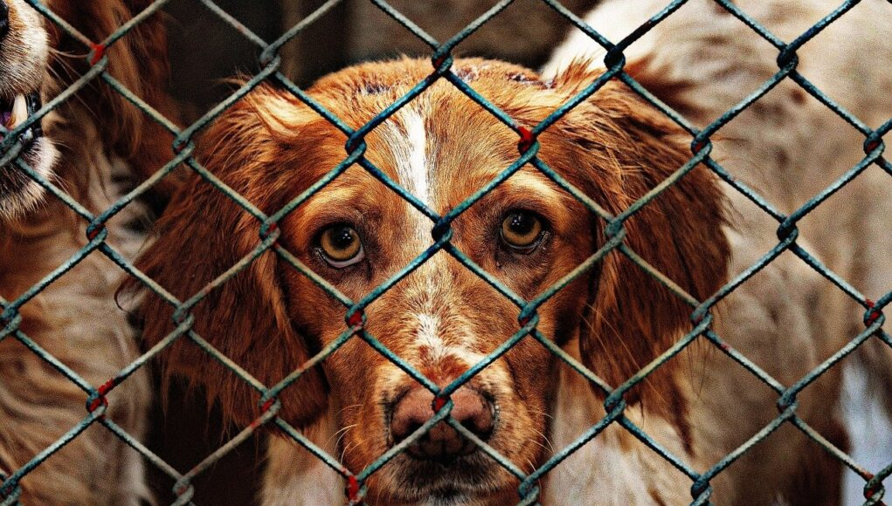
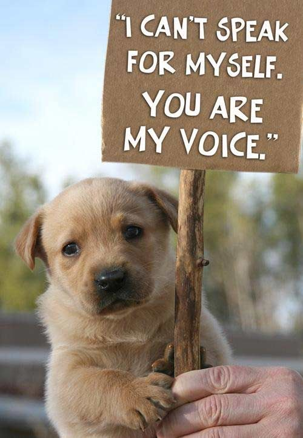
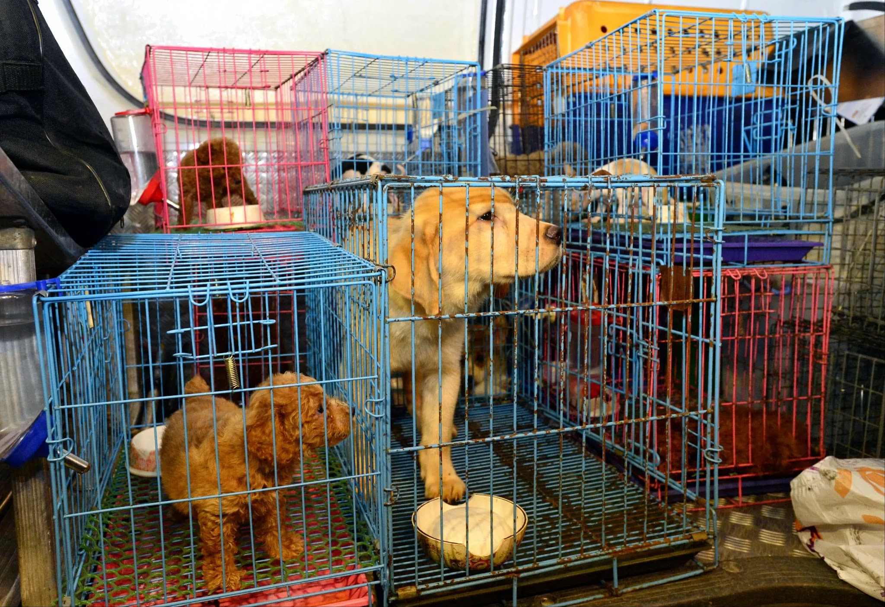

## What is Animal Cruelty?

Acts of violence or neglect against animals constitute animal cruelty.

The culture of Animal Cruelty has gone up as per the statistics during the pandemic. Due to the pandemic, many pet owners have contracted the virus and have abandoned their pets during the first lockdown and when the rumor spread that the coronavirus has the origin from animals, they abandoned their pets, some abandoned due to the financial crisis.

## Reason for the same

As it is well-known fact that pandemic has caused a lot of stress and feeling of depression in every individual, there is a lot of human suffering. To reduce personal stress and anxiety, people have started abusing their pets whoever they may be. In some cases, people started adoring their pets even more than before, but there were increased cases of abusers. Prevention of animal cruelty laws has been violated in large numbers.

Some studies show that the person who abuses pets or any animal, in general, are domestic violence perpetrators too. During the lockdown, many videos regarding the same went viral 

## Measures taken by the government

The Union government has proposed an amendment to the Prevention of Cruelty to Animals Act, 1960 (POCA) to increase penalties against animal cruelty from Rs. 50 to Rs. 75,000 or “three times the cost of the animal” besides up to five years' imprisonment.

> The greatness of a nation and its moral progress can be judged by the way its animals are treated - MK Gandhi

Another example is the Anti-Slaughter laws are also there in some states to prevent the mass killing of cattle.

If you witness suspected cruelty to animals, I urge everyone to call your local animal control agency as soon as possible or dial 9-1-1 if you're unfamiliar with local organizations. If you make a report of alleged animal cruelty, the responding agency is required to investigate and you can also mail at [info@petainda.com](mailto:info@petainda.com).