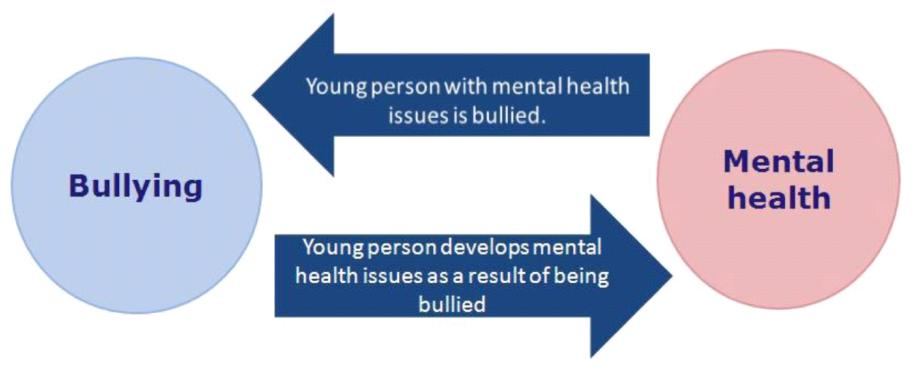
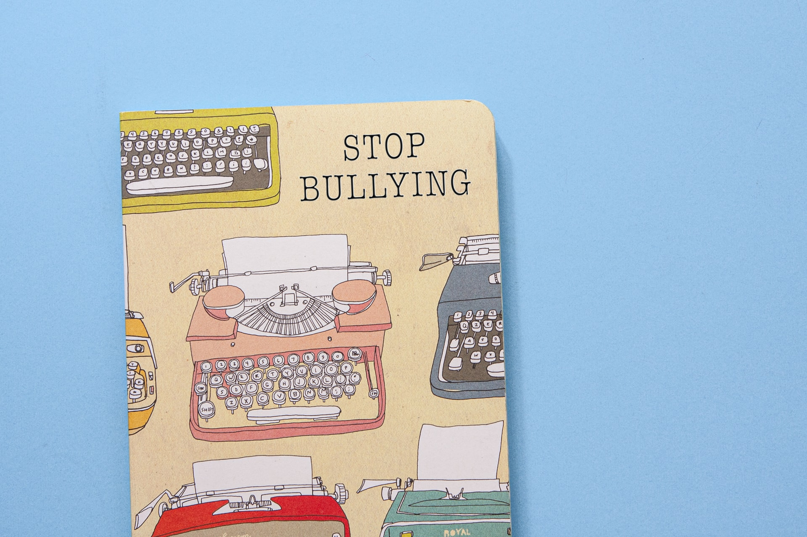

Bullying is a trend in which an individual or a group who is strong enough mistreat someone who is delicate or feeble as compared to the former.

The culture of bullying someone is growing more with the increase in internet facilities. It has grown rapidly in recent times worldwide. Bullying can be of different types which include verbal, physical, cyber, and psychological. People bully others regarding their weight, embarrass someone, or do something that triggers them. It generally occurs during or after school hours and now, in recent times, it has grown on the internet too. This causes psychological trauma to someone which leads them to anxiety and depression. In most cases, people tend to suicide if are psychologically unstable. In recent times, cyber-bullying is increasing due to the rise of social networking sites like Twitter, Instagram, Facebook. This is also another reason for the forthcoming **IT RULES**.

Some parents also replace their own anger, beliefs, insecurity and control their children in their own way which leads to the aggressive behavior of their child for which children inturn are blamed again.

Recently, the bullying against doctors is also very disturbing. They are considered next to GOD who works selflessly and in return, they are bullied instead of respected. This is high time to control these things. 

There was also verbal bullying by Baba Ramdev as he stated in one of his videos that **“allopathy is stupid and failed science and lakhs of patients have died after taking allopathic medicines ”**. This was a very vague statement as thousands of doctors are risking their lives to save every patient, working every single day with no leave. They are also not mentally stable to work tirelessly in midst of this **“mentally exhausting”** pandemic.

The other instance is of the last year's most famous incident of **“Boys Locker Room”** in which some teenage boys from Delhi have made an Instagram group and leaked chats and some intimate pictures of about 15 girls. This kind of cyber-bullying is increasing day by day.

People can complain regarding cyberbullying on the Indian Government’s helpline number **“[112](tel:+91112)”**.

There should be lessons regarding bullying as an offense in school. Schools should take adequate steps if some students bully others. It would help the person to make changes in themselves who bullies at a young age which can control future bullying.