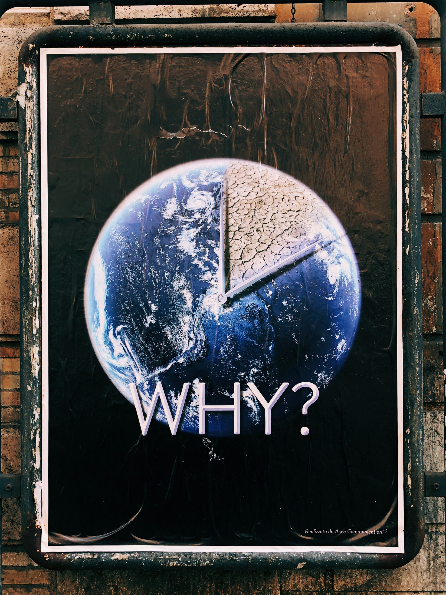
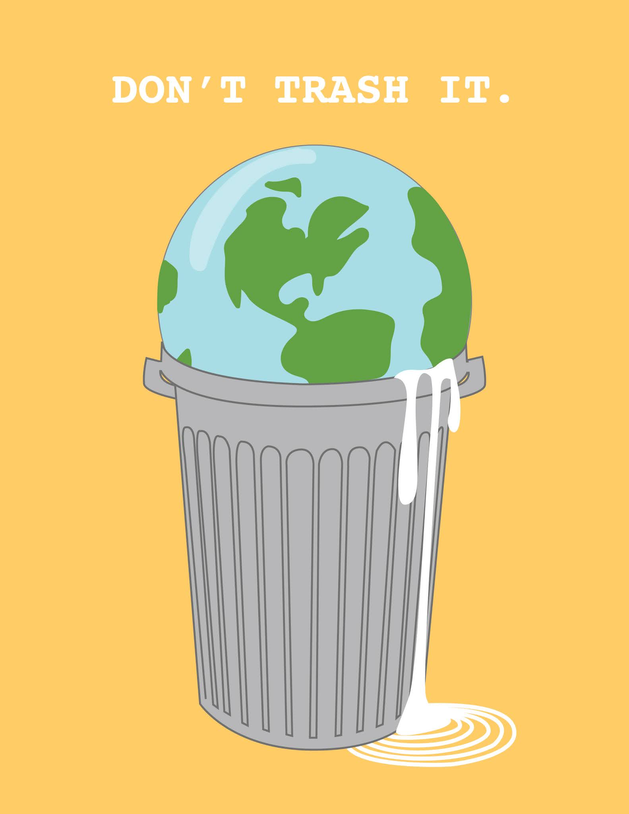

Climate change is an emerging issue globally that can be another pandemic in the near future if we will not take steps to control the temperature below 2 degrees Celsius now. Uttarakhand Flash Floods due to the glacial break in the Tapovan-Reni area of Chamoli District of Uttarakhand is a recent example of climate change. Cyclone Tuktae and Yaas are the other two examples of climate change. The loss of lives and livelihoods is abysmal.

Climate change is caused due to the excessive amounts of greenhouse gases in the atmosphere, the affluent use of resources, deforestation, etc. India is the third-largest emitter of greenhouse gases, preceding China and USA as second and first emitter, respectively. There is a need to make our youth understand and educate about climate change and how serious it is to not use resources unnecessarily.

Recently, India and USA  had conducted a leaders summit which is a joint initiative of both countries towards climate change and cleaner energy. India committed to deploying 450 Gigawatts of renewable energy by 2030 to meet the ambitious 2030 sustainable development agenda or goal 13 of SDG.

As per the 2011 census, the age group of people between 15-24 years constitutes 19% of the total population of India. The population has increased to 34% in 2020. The youth of the population needs to be educated that they should use the resources judiciously as Climate Change is a real problem.

An agreement was also recently signed in 2015 between 196 countries of the world in Paris to tackle the problem of Climate Change. This agreement is also called the Paris Agreement. The main aim of this agreement is to limit global warming to well below 2° Celsius, and preferably limit it to 1.5° Celsius, compared to pre-industrial levels and to achieve the long-term temperature goal, countries aim to reach global peaking of greenhouse gas emissions as soon as possible to achieve a climate-neutral world by mid-century.

India is at the stage where India needs to do development and reduce the Greenhouse Gases at the same time. The youth of the country needs to use the resources efficiently and discourage the affluent usage of resources. They need to understand that Climate Change is the real issue and we need to take actions regarding this and act as a responsible citizen of the country. We have a single mission that is to protect the planet and hand it over to the next generation. Small actions can have a big impact.

So, we need to work at local levels to achieve the dual goal of development and reduction of Greenhouse Gases at the same time.