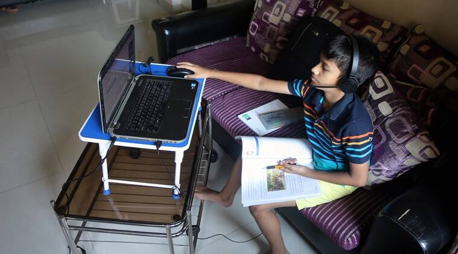
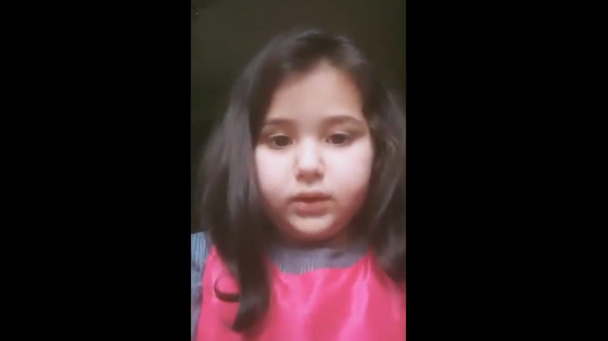

The shut-in the school due to pandemics has increased the inequality among children between different sections. There was a sudden change in the teaching from the conventional method to the digital method. The digital divide among children has widened the already wide gap. Education was the most affected during the pandemic. Some parents could not afford the mobile phones, internet facility, etc., and some parents in rural areas who could not provide these facilities to their children, suicide.

Toddlers, who were in their primary grades could not get benefit from the in-class sessions, activities, competitions, etc. They could not make friends enjoy in-class sessions.

 The secondary grades students who are in their growing age cannot be able to perform their hobbies in school. They did not get the opportunity to explore and learn something apart from academics.

And most important, the senior students who have their most important academic sessions could not enjoy live learning and instead, they too have to learn from zoom, google meet, etc. They are the ones who have missed everything from trips to farewell, once in lifetime experiences.

There was also uncertainty regarding the **BOARD EXAMS** of **class** **X** and **XII** in the midst of the second wave. The exams were canceled for class X and postponed for class XII as announced and a review meeting was scheduled for 1 June for the conduction of CBSE exams by our honorable education minister Mr. Ramesh Pokhriyal but there was a lot of pressure in the minds of children which led some children to anxiety and depression, basically, uncertainty caused mental health issues to children. Finally, the decision was in favor of and safety of children. This has relaxed every child who was anxious.

Online learning was not up to the mark for various subjects for seniors, toddlers who just entered the school and could not sit for long hours in one stretch and also could not cope up with the increased burden of homework.

Recently, a girl of 6 years from Jammu and Kashmir urged our Prime Minister to reduce the burden of classes and homework for Class 1 to which the lieutenant governor of Jammu and Kashmir responded by directing the school education department to come out with a policy with 48 hours to reduce the class hours and remove the homework till V class.

It shows how children are fed up with the online system of education.

On the other hand, teachers were the hero of online teaching. They worked hard more than anyone. Usually, teachers used to work during school hours only but now they work day and night. Aged teachers found it hard to adapt to technology but they still managed to do so.

Basically pandemic has changed the nature of the education system a lot. There was a big shift from physical classes to digital. The digital divide was the most vulnerable thing during the pandemic. There will be a complete change in education in recent years.