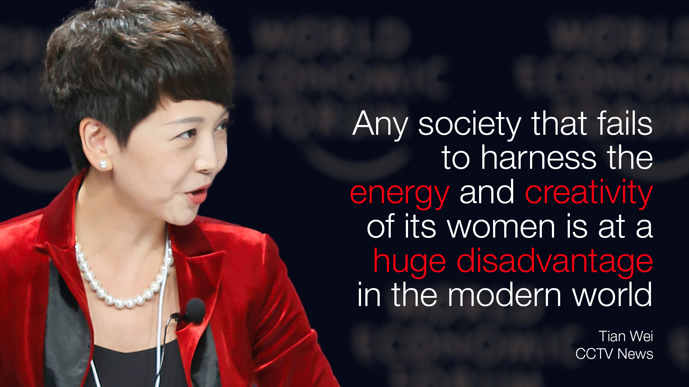
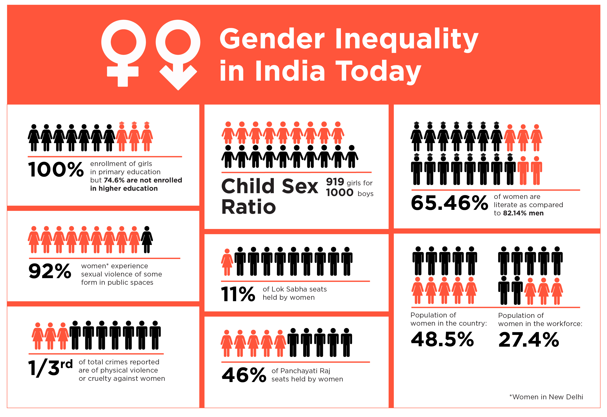

In the 21st century, gender equality is an essential component to foster the economy; to promote a safe, healthier, equal environment to the youths. Gender inequality, generally, characterized as the unequal perceptions of individuals based on their genders. There is widespread prejudice among males and females in various fields. Of all the aspects that influence the different tasks is the “Males decisions” which are always superior to “Females decisions”.

Because of Gender Stereotypes, women are often less valued and discriminated against. Their ability to do something is judged by their gender. Women are described as the perfect role model of “YES” and Men’s are taught from a very young age that they are superior. Women, in some conservative families, are asked that they should not do something which would affect their family status but on the other hand, they conceal their men’s counterparts doing the same thing. This is what happens in most families. Females are most likely to experience the restriction in a family where males are likely to enjoy. 

When someone thinks of a business, they are struck by the image of male members because of the long-standing stigma that only males can do business. Women are questioned every time they want to do something professionally which is done by men from generations, they are offered low salaries for the same work as their male counterparts.

India had ranked **112/153** countries in the **GLOBAL GAP INDEX 2020**. India has slipped 28 places to rank **140/156** countries in the **WORLD ECONOMIC FORUM’S GLOBAL GENDER GAP REPORT 2021**. These ratings help to analyze the previous policies and formulate new policies according to the data. Certain schemes have also been implemented by the government to build the bridge of equality. Certain Scheme includes “Beti Bachao, Beti Padhao”, “Mother and Child Tracking System”,“ Rajiv Gandhi Scheme for Empowerment of Adolescent Girls ”etc.

We can also take individual baby steps to reduce biasness by speaking about their personal experiences, encouraging women’s to participate in every field and not target them on their preferred profession, **calling out discrimination in the media and advertising, supporting small campaigns, call out discrimination that occurs at the local level and help someone of your known.**