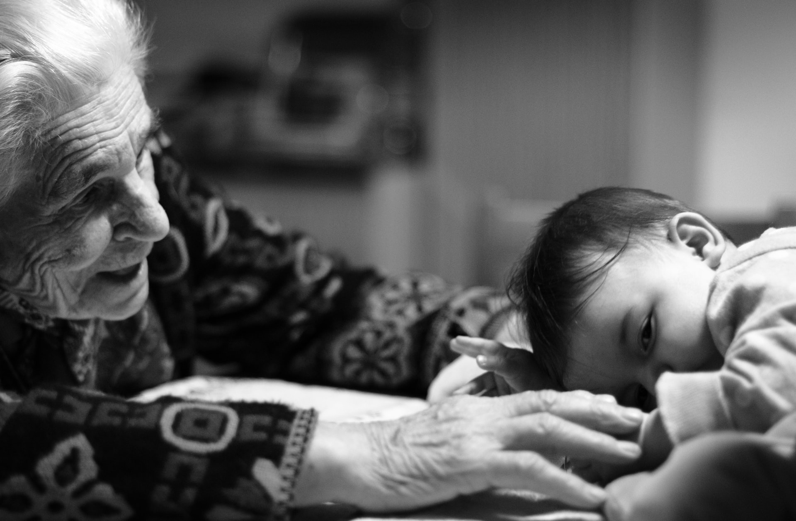
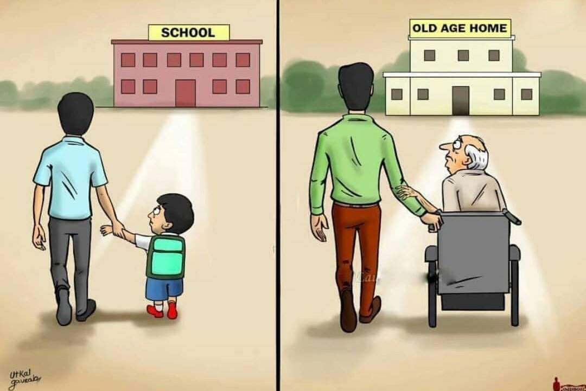
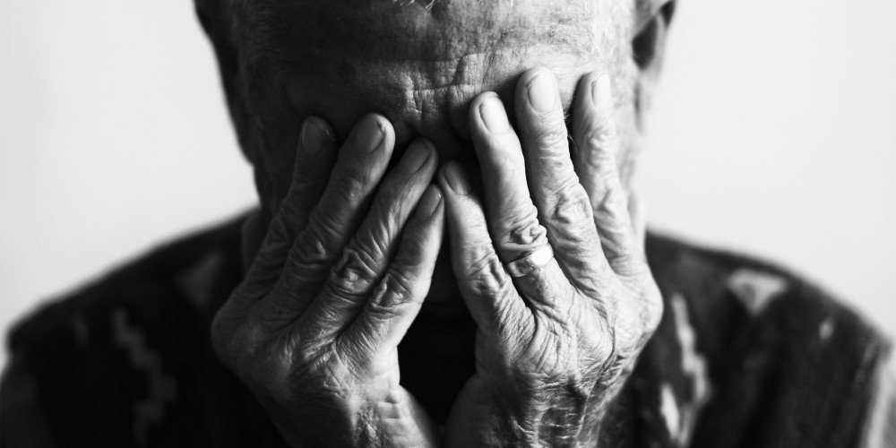

## What is an “Old age home”?

An old age home is a place where old people can live together and be cared for when they are weak or ill and cannot take care of themselves but nowadays, people have changed its meaning and they send their parents to old age home deliberately to avoid taking care of them and earn a better livelihood for the comfortable life.

## How the trend has changed?

To understand the very concept of old age homes, we have to go back to the history where people used to live in joint families and perform every activity collectively which makes them dependent on each other but the trend has changed now and most people lives in nuclear families which makes them do everything of their own and are independent. The thinking of the people have changed dramatically and they think that it is worth it to send their parents to the Old age homes and earn a good livelihood abroad or basically away from their parents.

## Is it a good option to send parents to the old age home?

This question raises another question that ‘‘Is it good to send the children to orphanages when their parents are alive or can take care of them ?’’ The answer is obviously “no”. No parent would do that but the children of this generation are too busy or find it too cool to send their parents to old age homes and not care for them who gave them birth, who lived their entire life fulfilling their demand, who cared for them their entire life. This generation lives in the stigma of being cool, showing off their wealth and all. They do not care about their own parents.

## The Message passed to the next generation

Children often learn from their parents and follow them. In today’s generation, people tend to pass a very wrong message to the next generation that not taking care of their parents is “cool”. They don’t think that they will also be at the same place after a while and their children will do the same thing to them.

I urge every youngster to not influence through this and take care of their parents religiously as they do.