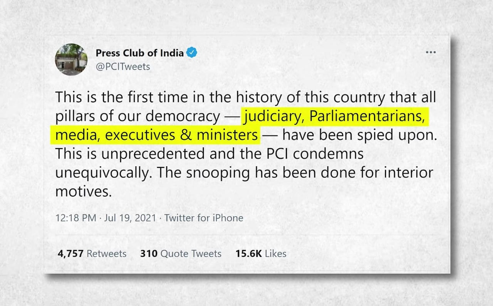
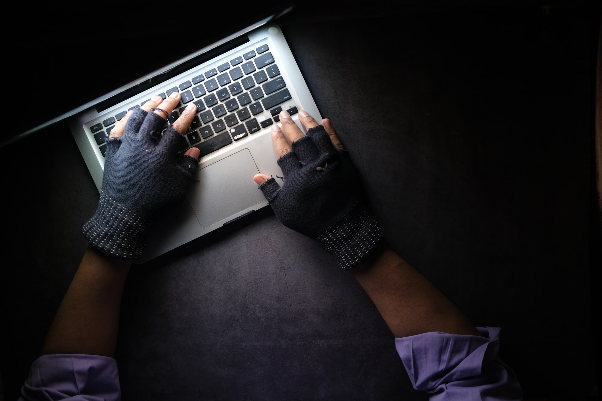
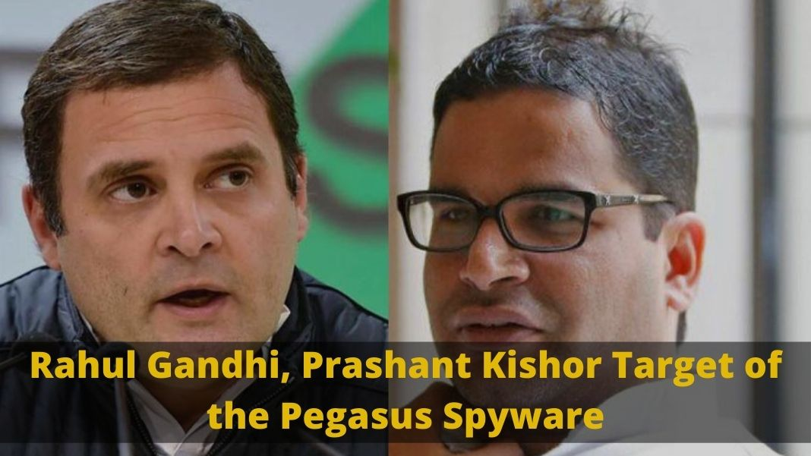
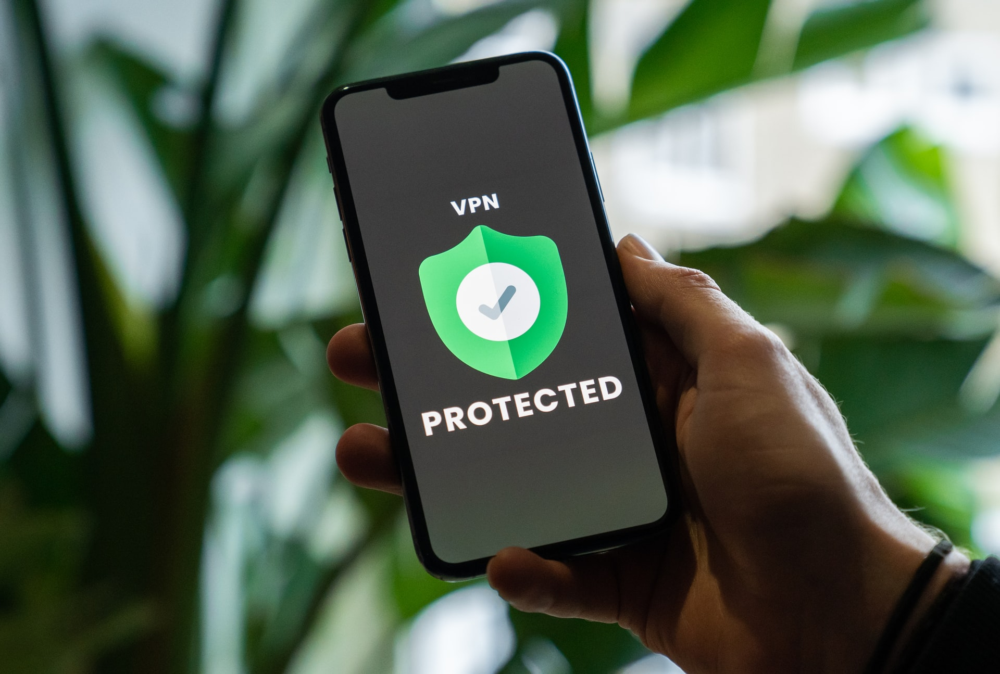

<!--StartFragment-->

Pegasus is spyware developed by Israeli NSO group technologies in 2010. This firm is made selling solely to the government agencies like RAW, ISI, etc. for the purpose of preventing terror attacks and crimes as claimed by the company.

<!--EndFragment-->

<!--StartFragment-->

How does it work?

It enables remote surveillance of smartphones by tracking personal details like GPS, photographs, videos, contact details, audio, etc. Pegasus is a very expensive malware designed to have surveillance on the interested parties. A message is sent on the victim's phone and when one clicks on it, the spyware gets into the phone. In some cases, it is also caused by ‘Zero click vulnerability’ that means a link will be sent to your phone and the pegasus will automatically present in your phone.

<!--EndFragment-->

<!--StartFragment-->

## Response of the governments around the world:

Algeria, France, Hungary have started the probe into the allegations of this spyware. Indians have also demanded a probe by the Supreme Court into this matter but the Government of India has claimed that this is all international conspiracies and denied the probe. Press club of India tweeted that for the first time in the history of India that all the pillars of democracy have been spied upon.

## India and the Pegasus:

In India, many journalists, politicians, constitutional heads, activists, etc., and Indian dissenters are being monitored by Indian agencies. In total,300 people from India are at risk for surveillance of Indian spy agencies. The rapid decrease in battery usage, slow down of the phone are some of the indications of Pegasus present in your phone. On the other hand, many countries have started probing into matters including Israel.

People who have been surveillance by this malware:

* Emmanuel Macron, The French President
* Rahul Gandhi, Indian Politician
* Prashant Kishore, Chief Election Commissioner, and many more.

## Prevention from Pegasus:

This virus can be prevented if one gives their phone numbers to only their closed ones as this virus needs the phone number to have the virus in your phone and it can also be prevented if the phone is in VPN mode as it helps to hide the location of the individual.

