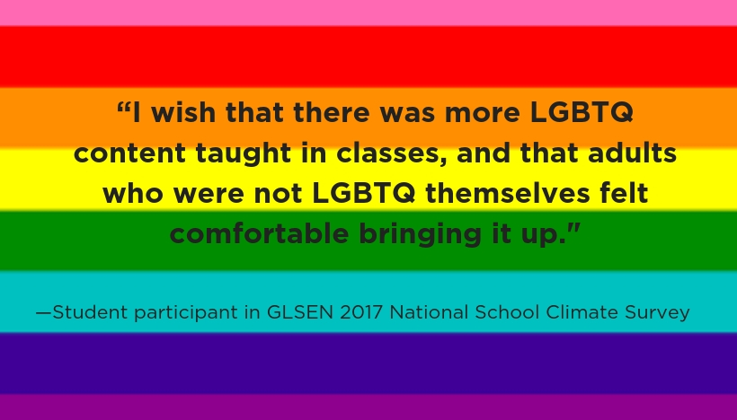
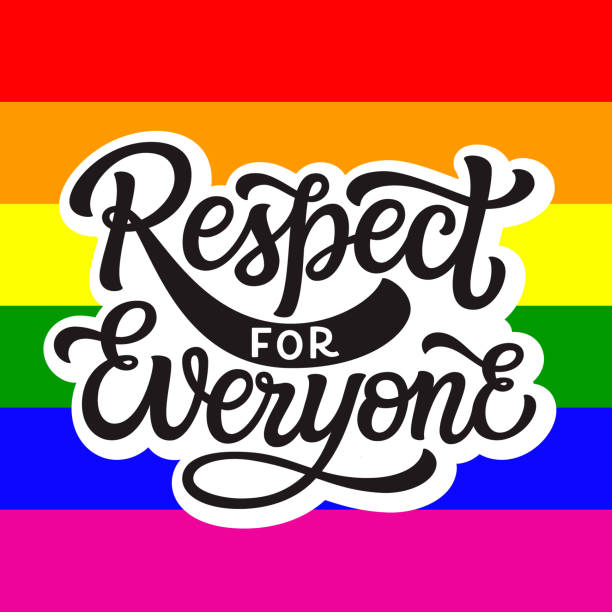

The LGBTQ+ community is an abbreviation to **Lesbian**, **Gay**, **Bisexual**, **Transgender**, **Queer,** and **others** which is signified by **“+”**. There is wide discrimination between them in every field of life, they are denied jobs, education, adequate healthcare facilities.

Due to the non-acceptance of society, people tend to conceal their sexuality or feel bad about themselves and can not be able to accept themselves the way they are and face a lot of criticism, harassment, bullying, and discrimination. They face unacceptance and criticism from their own family members as their parents are not comfortable accepting them as lesbian, gay, transgender, bisexual, etc. and that’s when they feel bad about being unaccepted by their close ones. Some parents often ask their children to treat themselves to become non LGBTQ+. In recent times, there are also rapid suicide cases due to unacceptance. People need to understand that this is natural and nothing wrong with being gay or lesbian.

In June, people across the world celebrate **“PRIDE MONTH”** to achieve equal justice and non-discrimination of adequate health facilities, education, job, etc., and to spread awareness about the LGBTQ+ community across the world.

Earlier same-sex marriage or transgender marriages were considered a crime in India and they faced legal difficulties in addition to the societal difficulties which were not faced by non LGBTQ+ community but on 6 September 2018, the Supreme court of India ruled **Section 377** as unconstitutional which criminalized the LGBTQ+ community as it violates the very fundamental rights of an individual.

Although, many countries have still not recognized the community. The UN suggests that decriminalizing the LGBTQ+ community by other nations will also help eradicate or reduce HIV-AIDS and suggest giving equal rights to the community. Decriminalization comes with more self-acceptance and confidence in themselves. After the decriminalization of Section 377, some parents also accepted their children as they are, willingly.

To reduce the taboo of being bisexual, gay, etc., the Minister of Health and Family Affairs has recently launched an app called **“Saathiya Salah”** which educates youth about same-sex attraction. He also stated that **“It is important for adolescents to understand that such relationships are based on mutual consent, trust, transparency, and respect. It is alright to talk about such feelings to the person for whom you have them but always in a respectful manner”**. It is completely an applaudable step by the government to spread awareness about this issue and educate the youth. It will help reduce the long-standing stigma of society, which provides them the feeling of dignity, self-importance, and self-confidence.