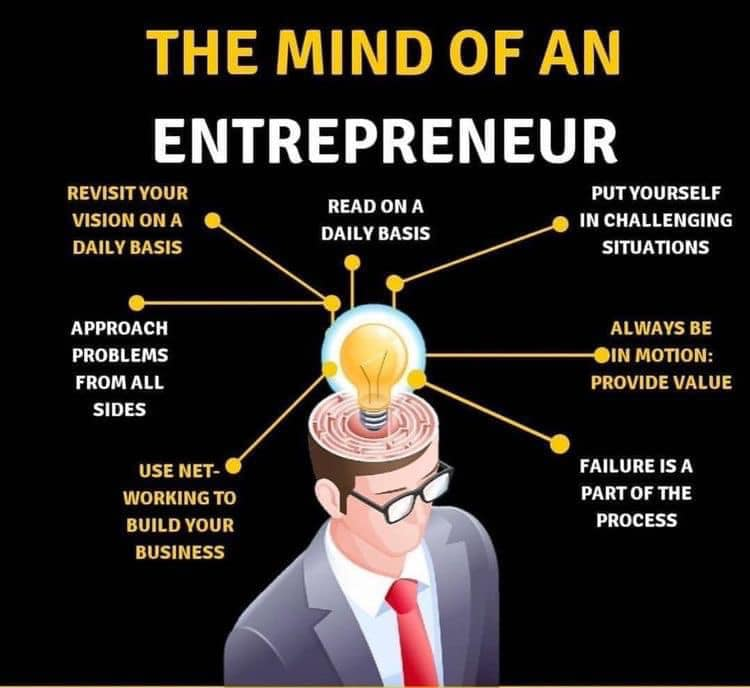

The changing trend of becoming job creators from being job seekers is currently getting highly eminent in India. The mindset of people has changed over time and is evolved, many startups are setting up recently. People are becoming from employee to entrepreneur. Let me first explain the term entrepreneur.

## Who is an Entrepreneur?

An entrepreneur is a person who risks setting up is his own business or businesses, sometimes innovatively in the hope of earning profit.

## Changing trend in entrepreneurship mindset

India is changing and building a robust ecosystem for setting up startups in India. To encourage the startups, the Government of India has started a flagship program called “Startup India initiative”, **“MUDRA”**, **“Startup India Seed Fund”** etc. to assist the aspiring entrepreneurs financially. Our Prime Minister once quoted **“Take up one idea. Make that one idea your life, think of it, dream of it, live on that idea, let the brain, muscles, nerve, every part of your body be full of that idea, and just leave every other idea alone. This is the way to success.”**

Despite the pandemic, startups in India have grown significantly during that period too. This shows how India is becoming a hub of startups and entrepreneurship, finding a way to stay aloft. The entrepreneurs are finding a way in setting up startups in every sector such as health, finance, social commerce, etc. Many startups such as Ola Cabs, Swiggy, Flipkart, etc. are the many such examples of startups that came to heights due to the good entrepreneurship, patience, and hard work of years. 

Problems in pursuing what people “really want” :