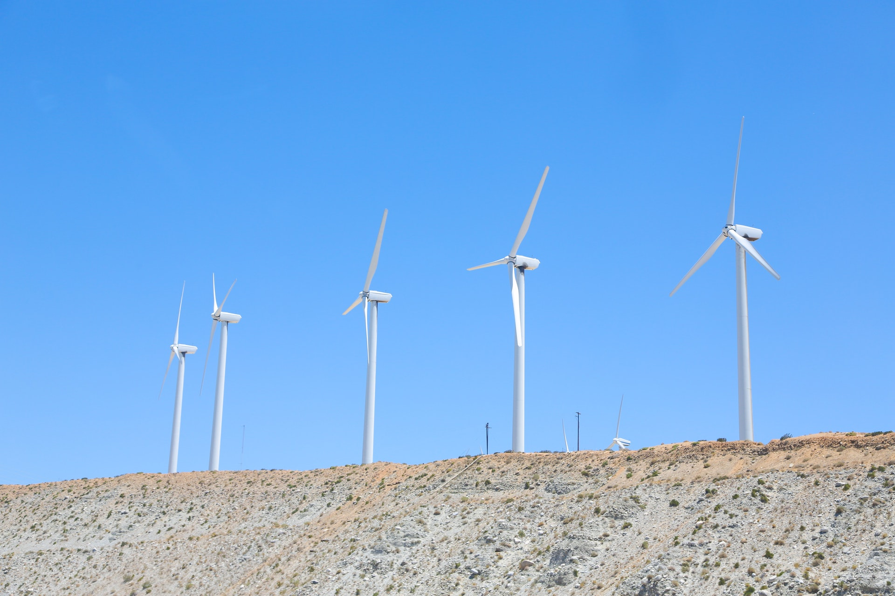
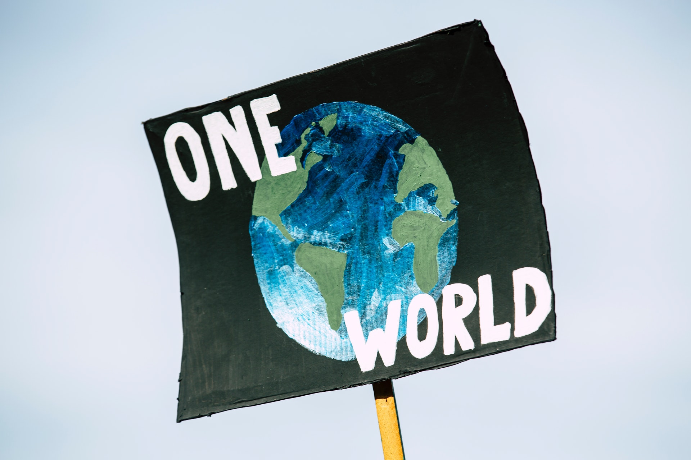

## **What is sustainable development?**

Sustainable development is the development that aims to allow all future generations to have access to all the resources by using the resources judiciously and sustainably at present. There are 17 sustainable goals which are adopted in United Nations General Assembly by all the 193 countries in 2015 and the target is to achieve these goals by 2030.

## Aims/Objectives

* Sustainable development goals are also known as **Global Goals** and aim to end poverty, discrimination against women, AIDS, etc.
* The end goal of all the goals is to protect the planet and ensure that people enjoy peace and a good lifestyle by 2030.
* The beauty of these goals is that they can be achievable with the help of individuals.
* Substitution of the usage of certain daily activities can help achieve the goal.

## Every effort matters

Recently, new startups are emerging as they claim to sustainably develop the products or develop the products which ensure that the extraction remains less than the regeneration.

* One such example is MAMA EARTH, a personal care brand that claims to grow saplings to every order made and also aims to grow one million trees in 5 years 
* Another example is Puma, a shoe company that also recycles waste in collaboration with First mile, an MNC.

This also encourages other companies to manufacture the products sustainably due to the competition and help us achieve the Global Goals.

## Solutions

With growing inequality, rich people tend to do wasteful consumption which further impacts sustainability. It is important to counter this through public awareness and certain limits should be there to prevent wasteful consumption. People should educate the people around them locally and do the needful at the individual level.