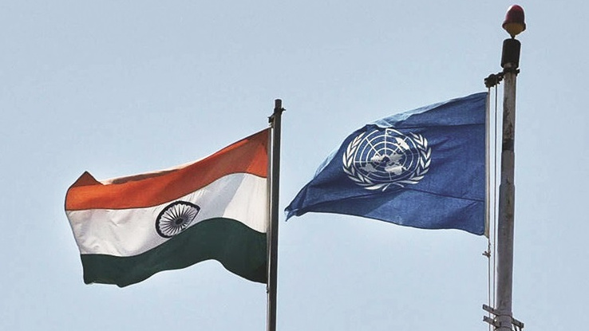
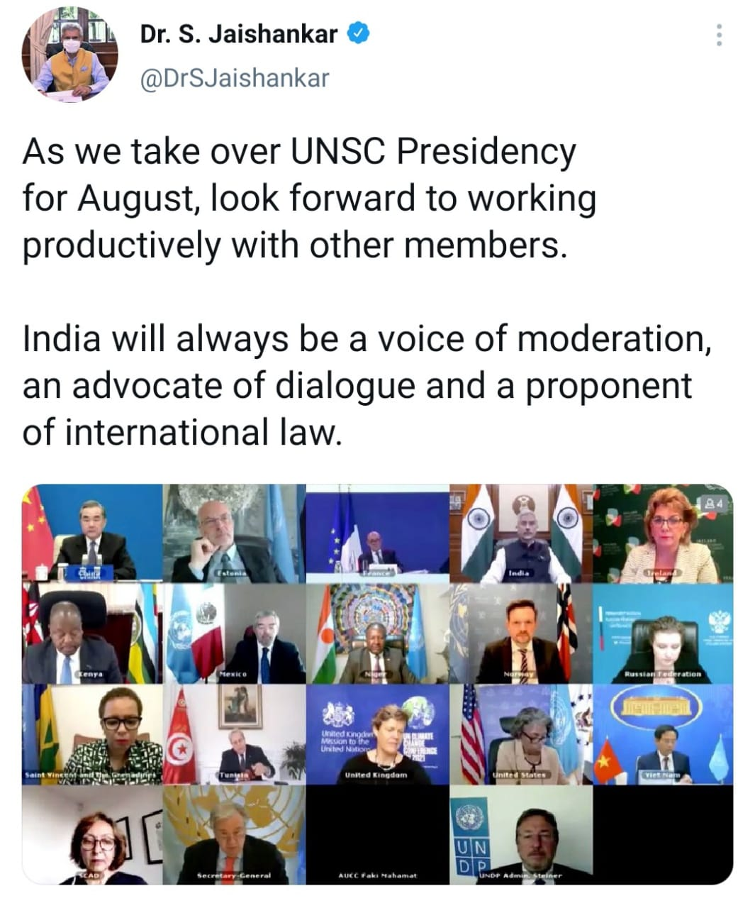
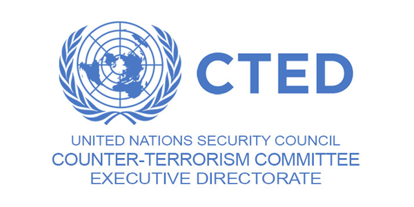

India joined the United Nations Security Council as one of the ten non-permanent members for 2-year tenure on 1 January 2021. India took over the presidency of the United Nations Security Council for the first time in France in August 2021. India’s presidency coincided with the 75’th Independence day of India. India will also assume the presidency in 2022 for a month. This is the eighth time India will hold the presidency in UNSC non-permanent membership. India was first elected in 1950-51 and was last elected in 2011-12.

During the presidency, India will deal with three issues as stated by T.S Tirumurti to the United Nations, India’s permanent representative of the UN: Maritime issues, Peacekeeping, and Counter-Terrorism.

India will organize a high-level meeting titled “Maintenance of International Peace and security” for enhancing Maritime security and cooperation to combat Maritime crime and issues.

The other meeting was titled “United Nations Peacekeeping Operations”.Its main objective is to protect peacekeeping forces by changing the obsolete technology of which India, Bangladesh, and Pakistan is the highest contributor of troops and materials. India is planning to deploy a mobile app “Unite Aware” which improves situational awareness for troops.

The third meeting will be held to combat terrorism and a meeting titled “Threats to international peace and security caused by terrorist acts”.India is seeking to address the linkages between terrorism and crimes by enhancing the coordination between the UN and Financial Action Task Force.

India has been advocating for a permanent seat in the UNSC along with countries like Japan, Germany, and Brazil for so many years but China is opposing it for fear of diluting the influence and authority they are currently holding.