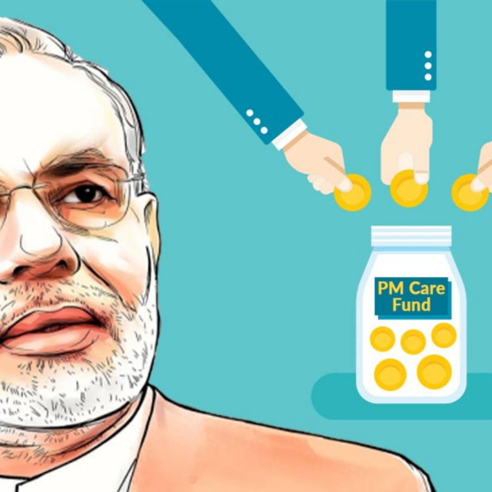
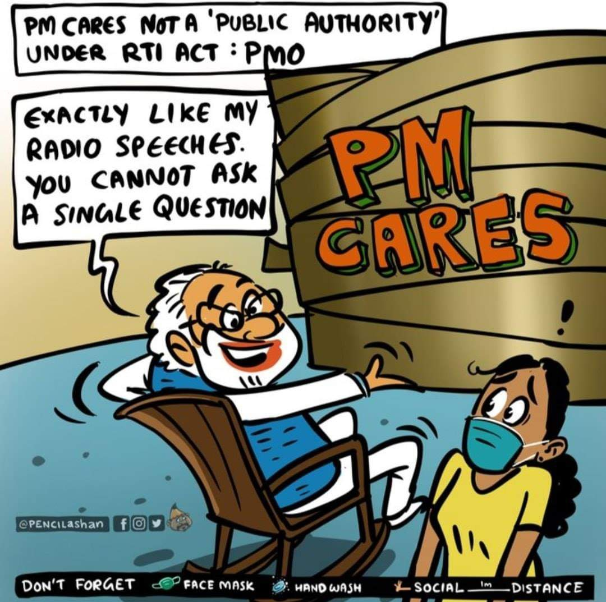
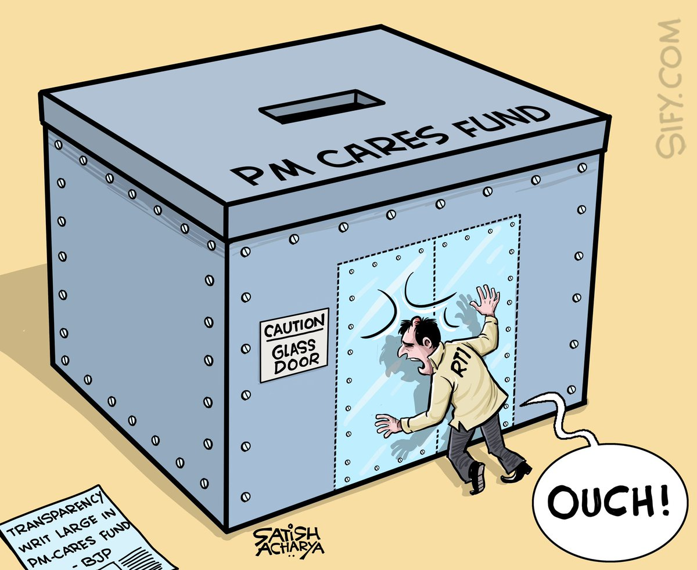
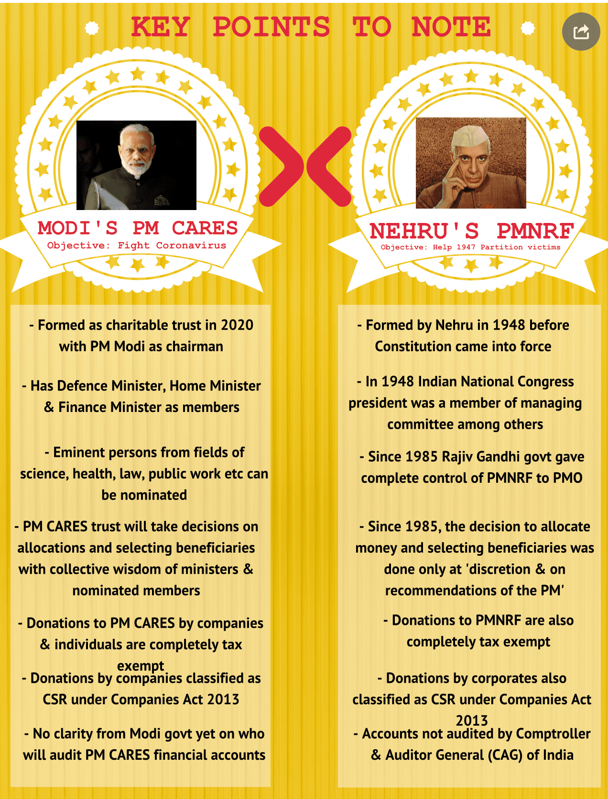
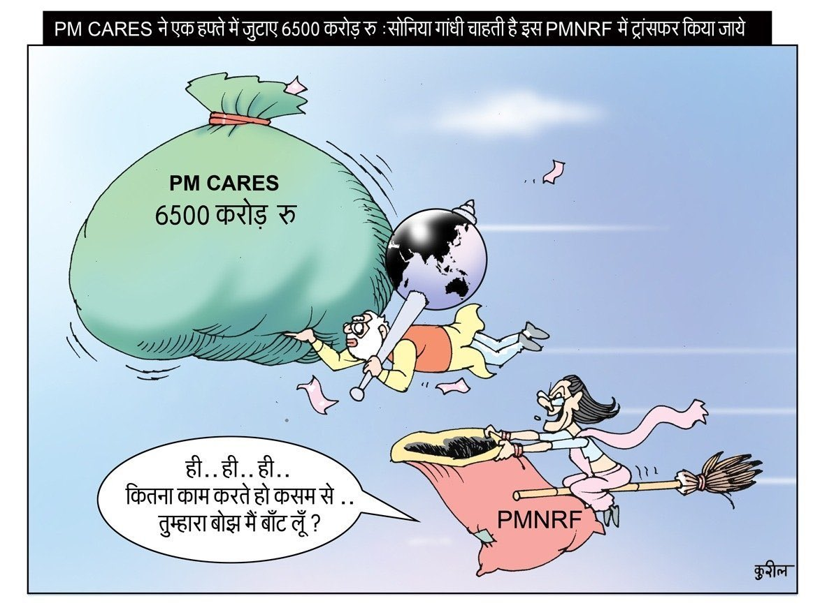

PM CARES is the abbreviation used for Prime Minister Citizen Assistance and Relief in Emergency Situation Fund. The main objective of this fund is to help the people of the country by contributing to their suffering which occurs due to various diseases and calamities like covid and many more.

In this fund, one can donate from Rs.10 to any amount they wish to. The fund does not go to the consolidated fund of India due to which it can not be audited by the controller and auditor general of India.

This issue has been long in controversy as the government was denying to share the information of the fund under the RTI and regarded the fund as **"Private"** and not the **"Government"** which contradicts the other things like the availability of all the information on the government website i.e. [gov.in](https://gov.in). It has also used all the designation of Prime Minister like the symbol of the nation, the tricolor, etc.

Another claim made by the PMO is that the fund is not related to the government either directly or indirectly but the trustees of this fund are PM, Defence Minister, Home Minister, and Finance Minister. If the fund is unconstitutional then all four members of the trustees can lose their constitutional powers as they are using their designation informally.

Certain tax exemptions are also done for this fund. It got exemption under FCRA or Foreign Contribution Regulation Act and a separate account for the foreign donations has been made. It also got the 100% exemption under 80G benefits under the Income Tax Act, 1961.

**PM CARES, the name was put up in such a way that it resembles as if PM really CARES for the people of India.**

## Constitutional Funds

NDRF (National Disaster Response Fund) and SDRF (State Disaster Response Fund) are the constitutional body constituted under the Disaster Management Act,2005. The main objective of this fund is to fight all-natural disasters including biological, chemical, and nuclear disasters, and to conduct search and rescue operations in the event of any natural catastrophe. These funds are constitutional and accountable which can be audited by the controller and auditor general of India as the funds are kept in the consolidated fund of India.

The other such constitutional fund is the " Prime Minister National Relief Fund " which was established by our first Prime Minister, Honourable Pt. Jawaharlal Nehru in 1948. Its main objective was to assist displaced people and prevent them from further atrocities and riots. This fund also has two trustees that are the leader of the opposition and the President of India.

The ruling government could use the money present in the PMNRF but they decided to not use it and make a separate fund which is reconstituted and unaccountable to the people of India under the RTI and that too with their own ministers.