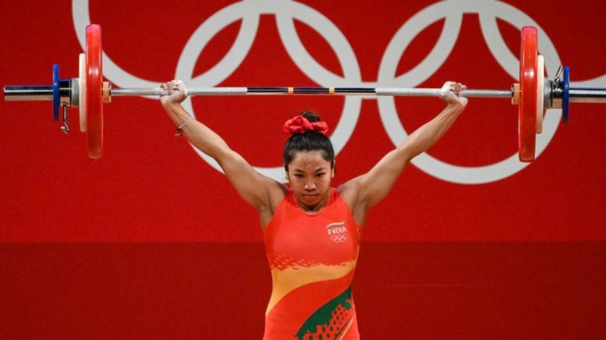
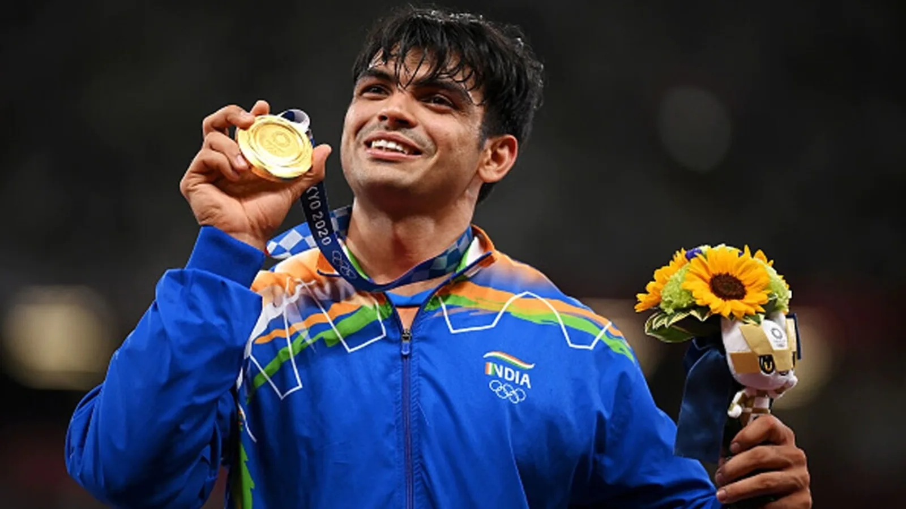
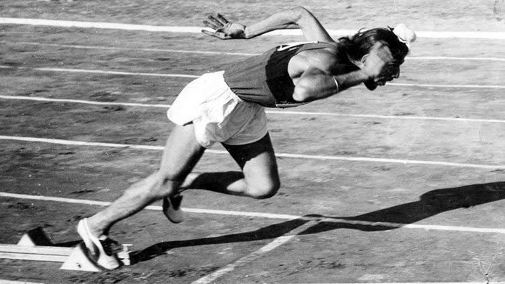

The Tokyo Olympics started on 23 July 2021 and had the golden end for India on 8 August 2021. India won seven medals in all. Four medals were bronze, two medals were silver and the last and the best medal was the Gold, the historic Gold which was the most awaited medal .1.4 Billion prayers were answered last evening and we had the best finish by winning gold.

## List of Winners

* GOLD: Neeraj Chopra
* SILVER: Mirabai Chaanu and Ravi Kumar Dahiya
* Bronze: PV Sindhu, Bajrang Punia, Lovlina Borgohain, Men's hockey team 

## Background of the Gold

A country that began participating in the Olympics in 1900, was long waiting for the Gold which was delivered by an Army personnel and a Javelin thrower, Mr. Neeraj Chopra on a random Saturday evening by throwing the Javelin 87.58 m away. India won its maiden and historic Olympic gold medal in athletics on 7 August 2021 and Neeraj is the second Indian who won Gold for India after Abhinav Bindra in the 2008 Olympics in the event of 10 m air rifle. Athletes like Milkha Singh and PT Usha missed the medals by some centimeters several times.

## Remembering Milkha Singh

The idol who inspired Neeraj Chopra was a late athlete, Mr. Milkha Singh who recently passed away due to covid whose only dream was to see a bar of gold for India. Neeraj dedicated his medal to Milkha Singh. He wanted to meet him with the gold but unfortunately, he is not there now. Athletes like PT Usha also tweeted that she realized her unfinished dream after 37 years and also thanked him which shows that so many dreams were completed by a single person yesterday who missed the medals by some centimeters.

## Proud time for India

India and all Indians feel so proud and inspired that a 23 years old Neeraj Chopra who belongs to Haryana came a long way from Shivaji Stadium to Tokyo Olympics. He inspired the youth a lot. Gary Calvert an Australian trainer who trained Neeraj for the Under 20 World championship in 2016 said that Neeraj would start winning medals in the 2024 Paris Olympics edition but he seems to be incorrect as he won the Gold in his debut Olympics three years prior to the estimated time.