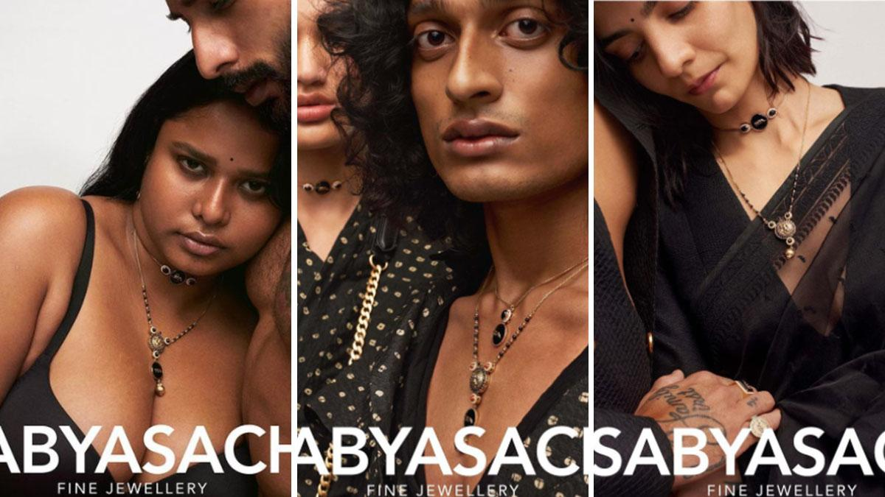
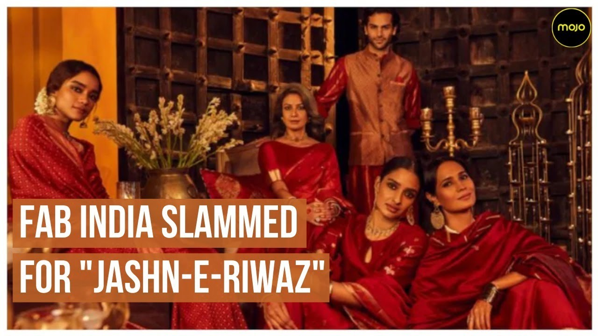
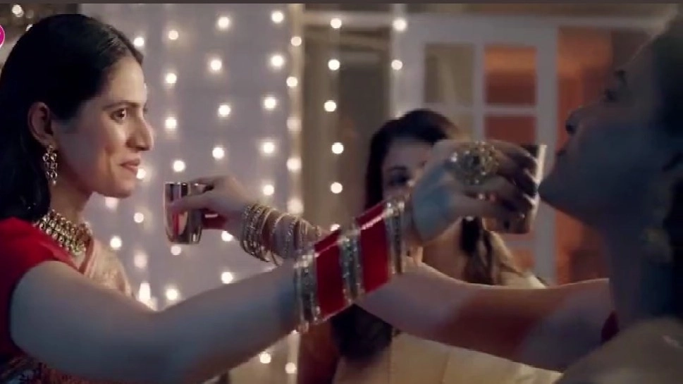
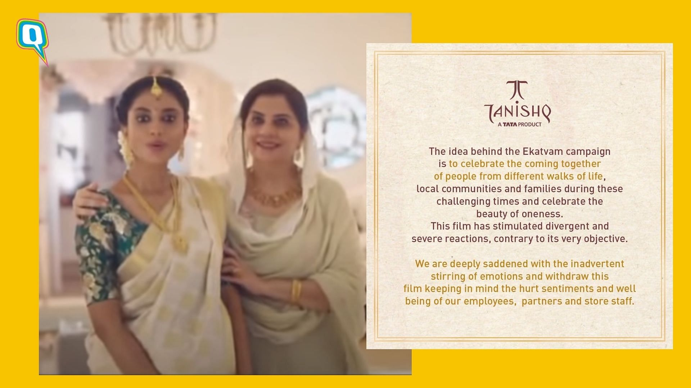

**Controversial Ads and sentiments of audience:**

From Tanishq ad to Fab India to Fem bleach to Sabyasachi, the controversies around the ads are never-ending. Basically, ads are generated for the profit motive and not for publicising or hurting someone’s religious sentiments (Mostly). Maybe we have different opinions with the broadcasters as the audience or maybe some have similar views with the broadcasters? And different opinions lies in every society.

Living in a democratic society, we have the very fundamental right to speech and expression and at the same time we have the fundamental duty of living “united” but the fact is that fundamental rights are legally enforceable and the fundamental duty is not which people take advantage of. People tend to group themselves as Hindu, Muslim, Sikh, Christian etc. and not view them as “Indians”.

**Have you ever thought that despite several ads being boycotted, why are they still making these types of ads which they think will be criticised by the audience?**

It is a tricky one but I must say that’s a marketing strategy. Using these strong words like “Jashan e Riwaz” in the ending of the Fab India ad led to public unrest on social media which led to the withdrawal of the ad.

The recent Fem Bleach ad on Karvachauth which again is the “Hindu festival” caused public unrest on social media platforms. It was criticised for two reasons: 

1. It was an ad that was promoting bleach.
2. The ad broadcasted on the Hindu festival again.

It was also appreciated by some for portraying two lgbtq+ community women keeping fast for each other on the occasion of Karvachauth and showing love towards each other as homosexuality is not socially acceptable in India even if it is accepted legally.

The Tanishq ad which was criticised last Diwali had the aim to integrate religion and portrayed Muslim in-laws celebrating the Indian custom of the baby shower of the Hindu daughter in law was accused of showing Love Jihad. I believe it is the way we see. Also, a quote says “Beauty lies in the eyes of the beholder” which is indeed so true as some people saw that ad as Love Jihad and at the same time some people saw that as the loving relationship of Muslim in-laws with Hindu daughter in law as a way to integrate the religious and promote “Unity”.

**The purpose:**

The main purpose of me writing all this is to make everyone vigilant of how we should take utmost care of our “Unity” rather than see us as “different groups”. We should consider ourselves as Indians first and then as anyone else. Together we can achieve anything and everything. I would like to end with the quote that “Unity in Diversity” which means to live together peacefully with respect and constructive criticism and with not blaming any group.

By: Loveleen Kukreja