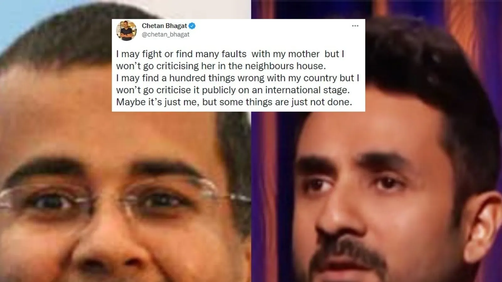

# Virdas controversy

Virdas is a standup comedian who went to the Kennedy Centre, USA to perform his show and there he performed a monologue which talks about “Two India’s” that is an India before 2014 which was ruled by Congress Government and India after 2014 which is governed by Bhartiya Janta Party. The derogatory and wrong facts and remarks about his own homeland will lead him to troublesome situations now as criminal proceedings have also been started against him.

In his monologue, he stated that 

1. “Women’s are worshipped in the day and gangrape at night”, but the fact that most of the rape cases have occurred in the USA itself where he was performing.
2. He also mocked India with the 138 crore population for the AQI getting 9000,
3. The value of Journalism is going down and he also portrayed journalists in a really derogatory manner as if they are working only because of sexual favors,
4. The thing about Indians bleed blue every time we play green and turn orange when we lose, there is nothing wrong with turning orange as it signifies our culture, our country,
5. The comment “Music is bahut hard and sentiments bahut soft ”, there is a reason behind sentiments being soft because Indian religion is now depleting at its best and there is the superiority of other religions rather than being equals and to preserve this we have to be “bahut soft ”and all this is happening in the name of “Secular joke”,
6. And last not the least, talking about the gigantic joke, there was no joke, to be honest, and only the degradation of Indian culture and Indian society as a whole.

Being an Indian myself, I can see the propaganda happening in Indian society. In the name of secularism, Indian society is getting divided between HINDU’S AND MUSLIM’S. The Hindu sect is known as “Bhakts” and the Muslim sect is known as “Liberals”. The idea of being Liberal is becoming so cool nowadays. In the name of being a “Liberal” or “Bhakt”, people tend to forget that they are Indians first and then anything.

Speaking about the speech, it was so terrible of him to speak about his own country and insult the country on an international platform and also the facts which are not correct. Criticizing is part of democracy but the way it was portrayed and the statement of the wrong facts are not acceptable at all in a democratic society as democracy has its own limitations and the right to speech is not an absolute right.