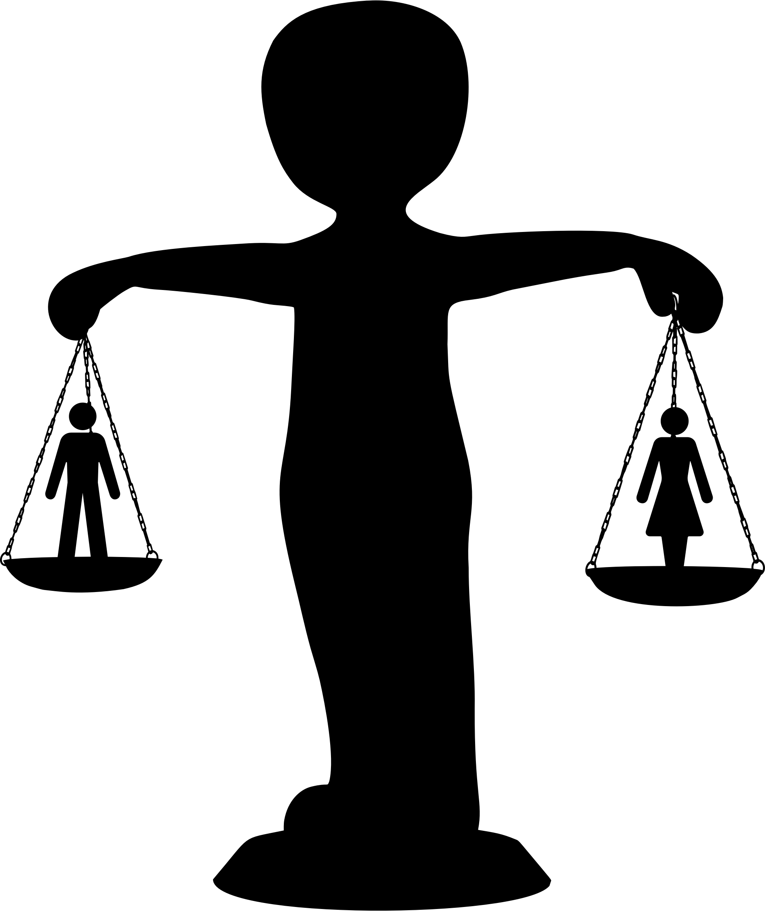
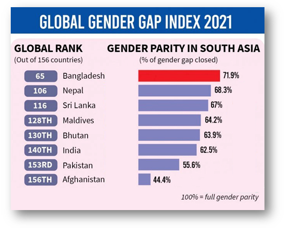
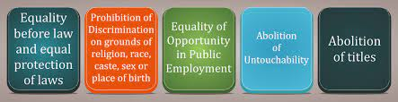
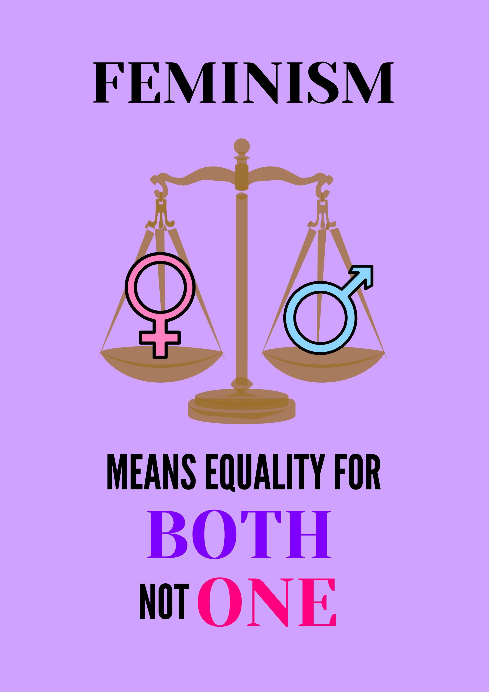
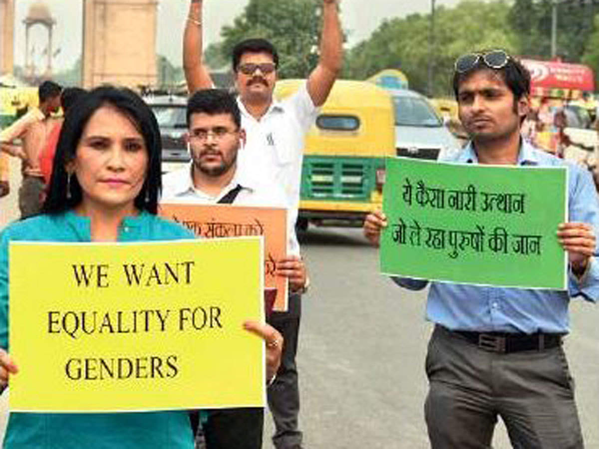
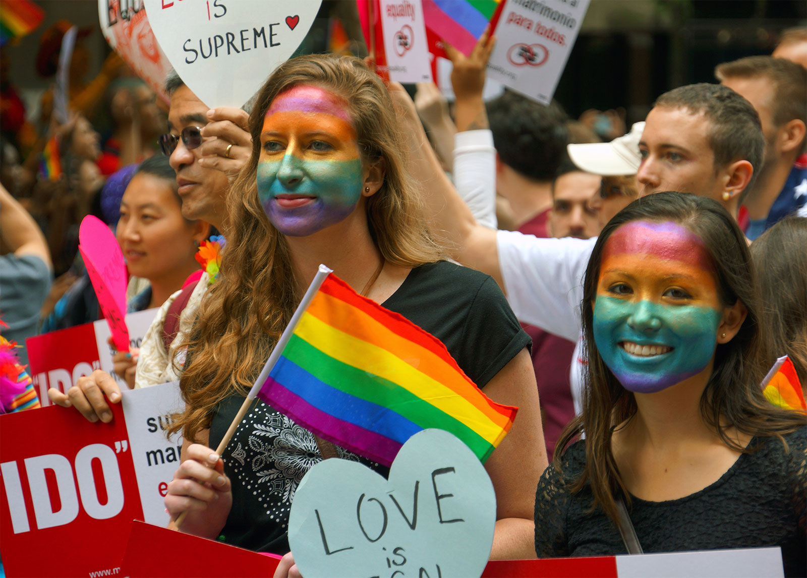
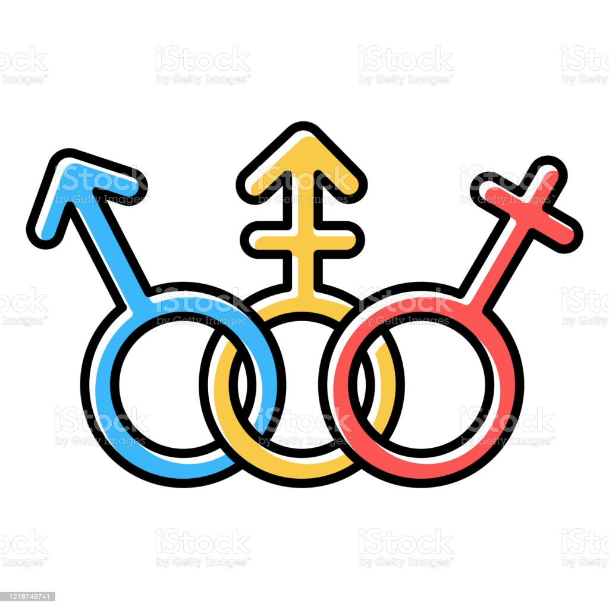

**Constitutional Essentials of Gender Justice :**

Justice means fairness, equality, and no discrimination. In a diverse and democratic country like India, justice is considered to be the foremost and the topmost priority for the courts and it should be the topmost and the foremost priority in society. Likewise, there is a serious and urgent need to give due attention to grave issues like gender justice and its constitutional objectives.

**As said by Mercedes Joubert, True equality is not the superiority of women, but the equal status of man and woman.** 

Gender Justice is a comprehensive and critical issue in a diverse country like India. There is a desperate need for us as citizens of India to look upon our society and change it for good and something positive rather than being just and silent spectators in society and work towards changing the society.

And when we talk about Gender Justice, the first thing that comes to our mind is the injustice to women and on the same note, we always ignore and forgets the fact that men are more targeted by fake allegations nowadays as compared to women for the interests of women who accuse them in fake cases. I am not denying the fact that women are not targeted but we as a society need to and have to understand that “ONLY” women are not victims or are targeted. To change society, we have to change ourselves first and then we can make awareness about this to someone. If every citizen of the country starts to think about this in a positive sense, then the country will shine like a bright star in the world.

**Fact check: India ranked 140 out of 156 in Global Gender Gap Index 2021 and it’s becoming a serious and critical issue in our country.**

Women have been the least concentrated in the matter of gender equality for ages. There have been many debates, marches, protests done to avail women’s the rights they deserve. 

1. One is the most famous Nirbhaya Case that caused awareness among people about the offences that were so grave and heinous and mostly they are not reported. Although the punishment to the offenders was granted after so long that case encouraged and made room for the people to report such crimes held against women.
2. The other most famous case was the Vishaka Case where Bhanvari Devi was a social worker who was gang-raped by upper-class men as a result of opposing Child Marriage but getting justice was so hard which led to public unrest among NGO’s and women to get justice. It was alleged that there was a violation of article 14, article 19, article 21 which is the right to equality, right to expression and right to privacy respectively. The decision by the judicial bench called for “Vishakha guidelines”, and later that was transformed into an act called Sexual Harassment at workplace act,2013. The case of Bhanvari Devi was the very first case related to Sexual Harassment at the workplace.

Gender Justice can be attained by the various provisions of constitutions but the lack of implementation of certain policies and laws are troublesome for society. The Constitution of India has provided every citizen of India with certain Fundamental Rights, Fundamental Duties, and some laws for the uniformity of society and prevention of chaos among individuals. Fundamental rights are not absolute in nature, there are certain reasonable restrictions to the fundamental rights. Also, Fundamental rights come with certain exceptions to complete the objective of upliftment of society. We can attain gender equality with the presence of some fundamental rights as stated below:

1. Article 14 (Equality before Law) in which everyone is equal before the law that means the state can not discriminate against different classes and as an exception, affirmative action is provided to the lower class for the upliftment in the society under this article, 
2. Article 15 (Prohibition of Discrimination) in which a state can not discriminate on the basis of caste, colour, religion, sex, place of birth and affirmative action is provided for the children and women under this article as an exception
3. Article 16 (Equality of opportunity in Public Employment) in which every citizen of the country have a fair opportunity in public employment and no discrimination shall take place on the basis of caste, class, sex etc. and some reservations are there for the upliftment of women in these, 
4. Article 17(Abolition of Untouchability), 
5. Article 18(Abolition of Titles)

With Gender Justice, the word “Feminism”  always comes to our mind and people are often confused about the meaning of Feminism. They tend to think that Feminism means to uplift women’s and become superior to men’s and dominate them but the actual meaning of feminism is to be equals in society and not dominate anyone. 

Women's are often neglected by the idea of being the hero of the house, the breadwinner of the house etc. They are underestimated at every stage when they want to fly high. To substantiate the saying that women’s are not given due care and attention and are considered secondary for the development of society, there are some facts that are stated below:

1. Even today, in most of the rural households girl child, are asked to marry after high school and not encouraged for education as compared to the male child. Through education only, one can change the thinking or mindset of the people and develop the society and the country. Women’s are expected to give attention to family chores, children etc. and when she thinks about herself, she is considered selfish. Although progress has been made but in rural households, female foeticide is still happening, dowry deaths are still occurring, preference of the male children is still happening, the anti-female child thing is still going which needs to be stopped NOW as it is getting really serious.
2. The abortion rights for women’s were not there till the Medical Termination of Pregnancy Act of 1971 which got amended recently in 2020. After the act, the provisions of this are not at all pro women’s. The criteria to abort a baby varies from married women’s and unmarried women’s. Married women are allowed to abort the baby with the consultation of one doctor if she’s 12 weeks pregnant and consultation of two doctors is necessary if she is 20 weeks pregnant. Unmarried women’s are allowed to abort the baby when she is 20 weeks pregnant with the consultation of one doctor and two doctors consultation when 24 weeks pregnant and a medical board approval too. These draconian laws lead to the invasion of privacy of a woman which is a violation of article 21 of the constitution.
3. Lack of female representation: Fatima Beevi was the first female supreme court justice who was appointed only in 1989 and there have been no single women Chief Justice of India in the history of India. There is a need for the proper appointment and representation of the vacancies in public establishments and women should not be discriminated against merely on the basis of their gender as it is important to uplift society as a whole.

On the other note, discrimination also happens against men. They are often left when the conversation of gender equality comes in. In today’s time, thousands and thousands of fake allegations are put on men but no one talks about it. It is the result of the “special provisions” given to women for their safety and upliftment but they tend to misuse it for their own interest. If we talk about Justice, Justice should be balanced and given to both parties rather than a particular gender. Justice should be given to humanity rather than the people who are providing chaos among humanity. There are certain things that need to be taken care of when talking about men constitutional imperatives. Laws should be made to prevent men from being the target of sexual harassment. Nowadays, for the sake of money, some women have made this a business to harass men and then earn through it by blackmailing them. One such example of this instance is the #MeToo movement against men where many fake cases were witnessed against men. There needs to be a recognition in the laws that men can also become the victims of rape and not every woman is safe. Due to the absence of this provision, misuse is happening on the large scale.

The most controversial category which is targeted and given unequal treatment is transgenders. They have been thriving for their rights for so long now. They are the most targeted people among the gender injustice. They are discriminated against in employment, education, day to day working conditions and many such things. Consensual sex between same-sex couples was illegal, and immoral according to the Indian society and constitution. After the long struggles and cases, a landmark judgement Navtej Singh Johar vs Union of India happened which changed everything for the transgender communities for good. It got constitutional on the grounds of the right to privacy that is article 21 of the constitution and also Puttaswamy judgement was referred to make the same-sex consensual intercourse legal. The legal barriers were removed and same-sex consensual intercourse got legal and constitutional in our country. Even if Section 377 that is the sexual intercourse between two adults of the same sex stands unconstitutional, then also people tend to find it morally wrong and see transgenders as the wrongdoers and criminals of the society. The constitutional imperatives that are necessary for transgenders are as below :

1. There is a need for urgent representation of transgenders in public establishments. Although an openly gay judge named Advocate Saurabh Kirpal has been appointed in Delhi High Court recently there is a need to spread vigilance to society among the transgenders being the normal people and not wrongdoers of the society and seats should be reserved for them in every public institution.
2. They are discriminated against for the renting or purchasing of flats/homes. They are asked to not influence society in their way. There should be a constitutional imperative that no one can deny renting, purchasing of any assets to transgenders.

To reduce the taboo of being asexual, gay, lesbian etc., the ministry of health and family affairs has launched an app known as “Saathiya Salah” which educates the people about same-sex attraction and all about consent. There is a need for people to know about same-sex couples being “THE COUPLES” and not criminals or influential people in a bad way. They have already seen a lot of violence and discrimination, the character questioning keeps on adding which leads to mental trauma, anxiety, depression and panic attacks. The legal barrier has been sidelined. Now, there is a need for us to sideline the moral barrier and respect each and every individual as a -human being and not as of certain gender or sex. Many positive things will happen as the result of section 377 being unconstitutional but the fact that they will be accepting them just the way they are and the emotional and mental stability amongst them will help them contribute more to society excites some like-minded people like me. It opens many positive rooms for them and they can live with dignity now. This will also help them ask for medical treatment freely as there were certain limitations to it before section 377 got unconstitutional for medical services and it will also help in availing treatments related to HIV prevention, testing and treatment services. Keeping humanity first and religious opposition at the second stop will definitely help us normalise things and keep the minority community (Transgenders community) in sync with what happens in a society.

To conclude this, one must always understand that misusing the rights and using the rights in the right direction is two sides of the same coin. One’s life can get ruined just because of someone’s fake allegations, mental torture, sexual harassment, physical abuse etc. And giving everyone rights to defend themselves are written in the preamble or the index of the constitution which states the objective of the constitution that it is to provide every individual with the liberty to speak up about their problems in loud or criticise the actions of the public policy or laws for that matter, to give justice to humanity rather than to a particular gender, community etc, to achieve equality among individuals that is among every individual and not just on men’s, women’s or transgenders, and to develop brotherhood or in the term of preamble that is a fraternity among each other in a society. To develop society, we need to work on ourselves, everything else will come with the flow. Education can change anything in a country from poverty to economy to social injustice to social inequality and many more. We need to change at the local level and make people aware at the local level, that is the only thing which will help us achieve huge targets at the international level/country level.