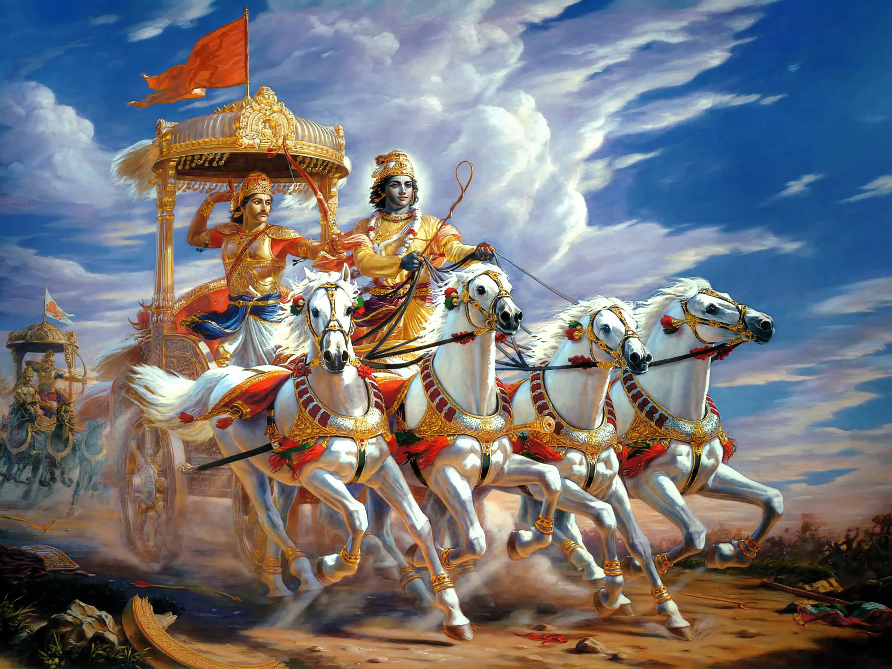

An auspicious day like Gita Jayanti is the most important Indian festival and is celebrated as the marking of the birth anniversary of the Bhagavad Gita, a holy scripture that is often misconceived as the “only Hindu” scripture. The meaning and the teachings of the Bhagavad Gita is widely accepted and applicable for everyone irrespective of their religion. Bhagavad Gita is the “Secular” scripture and not based on a particular religion. 

Bhagavad Gita is an ancient religious text which aims to provide spiritual knowledge and knowledge regarding humanity to individuals. This holy scripture provides the solution to our problems and self-fulfilment. It gives us a sense of individuality and provides a decent way and form to lead our life. No other scriptures provide the truths in such a beautiful way as the Bhagavad Geeta has provided. The main aim of the Bhagavad Gita is to deliver humankind from the sufferings of the planet. Bhagavad Gita is an ancient religious text that was written by Vyasa. Bhagavad Geeta itself means a song by the lord himself. A book named “Bhagavad Gita as it is ” is written by the AC Bhaktivedanta Swami Prabhupada and it is a verified source to read and take the teachings of Krishna Ji as it was spoken by Krishna 5158 years ago during the Kurukshetra war to Arjuna. The nature of the book is not changed and the correct message and teachings are transmitted through the above book written by Prabhupada.

Every person suffers in so many ways like Arjuna was facing and having to fight the Battle of Kurukshetra which is the origin of Bhagavad Gita. The main theme of the Bhagavad Gita depends on five subject matters of life and humanity that is Ishvara- the supreme god, Jiva- the living system, Prakruti is the environment, Kala is the never-ending time and Karma or the activities which we perform. The teachings are relevant from thousands of years, it was relevant from thousands of years back and it will remain relevant for thousands of years.

Youth and the teachings:

The youth of the world is neglecting the holy scriptures and they do not have any knowledge regarding the holy scriptures. Even if one has an interest in reading the holy scriptures, they are not encouraged to do this and instead the scripture is degraded. The recent example of Bihar Kendriya Vidyalaya School where a student who was reading Bhagavad Gita that too in recess was forced to leave the scripture by the teacher named Sadaf Jahan of the school and the holy scripture was thrown in the dustbin by that teacher and after throwing the scripture, she abused the gods. No Teacher, Principal and Police officer objected to this act and were okay with the fact that the holy book was thrown by Sadaf Jahan in the dustbin. Initially, the complaint was not registered by the police and they were given some suggestions like “ withdraw your child from school “ and all. The guardian of the student made the complaint against them with the utmost problems afterwards. 

This is the most discouraging act for the youth. This needs to be incorporated in the syllabus of the youth, that’s the only way, the youth of our country will get aware of the teachings of Lord Krishna. In the foreign nations, Bhagavad Geeta is taught by the teachers as the philosophy subject and the behaviour of the teachers in the diverse country like India where we are proud to have different cultures faces these incidents. We all need to protest against this behaviour and encourage the students and the youth to learn the teachings of the lord and get a direction to lead a life with humanity and incorporate spiritual knowledge into their minds. 

Let’s pledge this Gita Jayanti to spread the teachings of life and humanity, the way this teaching was given to Arjuna by Lord Krishna and make everyone vigilant about this issue.